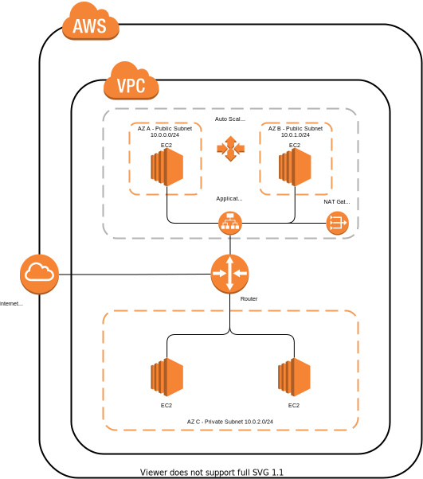

This terraform recipe provisions the following architecture. Create a terraform.tfvars files includes following
```
AWS_ACCESS_KEY = "YOUR_ACCESS_KEY"
AWS_SECRET_KEY = "YOUR_SECRET_KEY"
```
Terraform will create 2 instances on the Public Subnets, it can scale-in or scale-out up to 4 instances depending on the CPU load.

